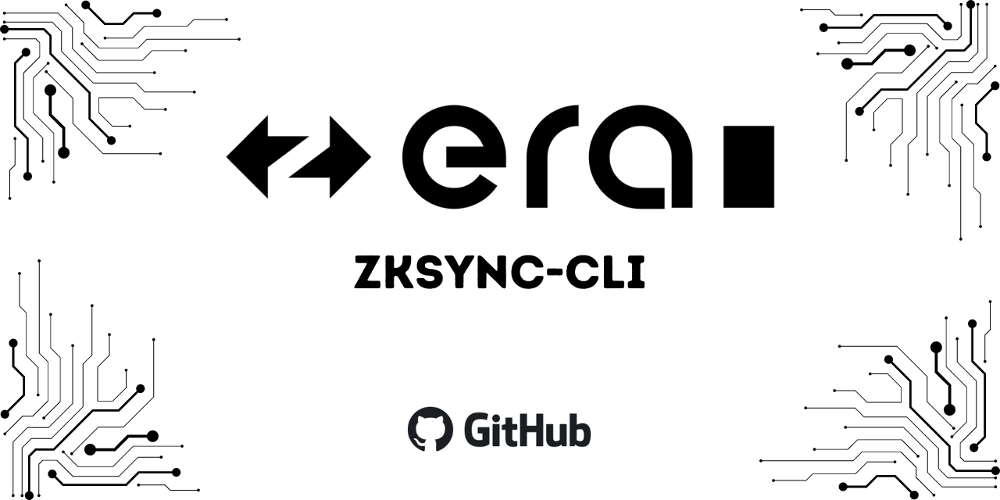

# ‣ zkSync CLI 

This CLI tool simplifies the process of developing applications and interacting with zkSync.

[Documentation](https://era.zksync.io/docs/tools/zksync-cli) | [Report a bug](https://github.com/matter-labs/zksync-cli/issues/new) | [Request a feature](https://github.com/matter-labs/zksync-cli/issues/new)

[pr-welcome]: https://img.shields.io/static/v1?color=indigo&label=PRs&style=flat&message=welcome

## 🛠 Prerequisites

- [Node.js v18 or higher](https://nodejs.org/en)
- [Git](https://git-scm.com/downloads)
- [Docker](https://www.docker.com/get-started/) (for `zksync-cli dev` commands)
- [Yarn](https://v3.yarnpkg.com/getting-started/install) (for `zksync-cli create` commands)

## 📥 Usage

You can run the commands directly via NPX with `npx zksync-cli {COMMAND}`.
Or you can install the CLI globally with `npm i -g zksync-cli` and run the commands with `zksync-cli {COMMAND}`.

## 💻 Commands

### Local development commands
`zksync-cli dev` - Manage local zkSync development environment. It allows to easily start zkSync stack locally, for example: local Ethereum and zkSync nodes, Wallet and Bridge.

**General:**
- `zksync-cli dev start` - start local development environment (will ask to configure if starting for the first time)
- `zksync-cli dev clean` - clean data for configured modules
- `zksync-cli dev config` - select modules to run in local development environment

**Modules:**

In addition to default modules, you can install custom modules from NPM.

- `zksync-cli dev install [module-name]` - install module with NPM (e.g. `zksync-cli dev i zkcli-dummy-module`)
- `zksync-cli dev modules` - displays list of installed modules

Run `zksync-cli dev` to see the full list of commands.

### Bridge commands
- `zksync-cli bridge deposit`: deposits funds from Ethereum (L1) to zkSync (L2)
- `zksync-cli bridge withdraw`: withdraws funds from zkSync (L2) to Ethereum (L1)
- `zksync-cli bridge withdraw-finalize`: finalizes withdrawal of funds from zkSync (L2) to Ethereum (L1)

### Create project commands
- `zksync-cli create project {FOLDER_NAME}`: creates project from template in the specified folder

### Other commands
- `zksync-cli help`: Provides information about all supported commands
- `zksync-cli help <command>`: Provides detailed information about how to use a specific command. Replace <command> with the name of the command you want help with (e.g., `create`, `dev config`, `bridge withdraw-finalize`)
- `zksync-cli --version`: Returns the current version

### 🔗 Supported bridge chains

By default zkSync CLI bridge commands support Era Testnet and Era Mainnet. You can also use other networks by overwriting L1 and L2 RPC URLs. For example: `zksync-cli deposit --l2-rpc=http://... --l1-rpc=http://...`

If you're using [local setup (dockerized testing node)](https://github.com/matter-labs/local-setup) with default L1 and L2 RPC URLs, you can select `Local Dockerized node` option in the CLI or provide option `--chain local-dockerized`.

## 👩‍💻 Developing new features

### Run in development mode

1. Install all dependencies with `npm i`.
2. To use CLI in development mode run `npm run dev -- [command] [options]` (eg. `npm run dev -- bridge deposit --chain=era-testnet`).

### Building for production

1. Install all dependencies with `npm i`.
2. This project was build with Typescript. Run `npm run build` to compile the code into `/bin`.
3. You can run your local build with `node ./bin`

### Testing

At the moment, we don't have any tests, but we are working on it.
In the meantime, you can test the code manually by running the code in [development mode](#run-in-development-mode).

## 🌍 Official Links

- [Website](https://zksync.io/)
- [GitHub](https://github.com/matter-labs)
- [Twitter](https://twitter.com/zksync)
- [Discord](https://join.zksync.dev/)

## 📜 License

This project is licensed under [MIT](./LICENSE-MIT).